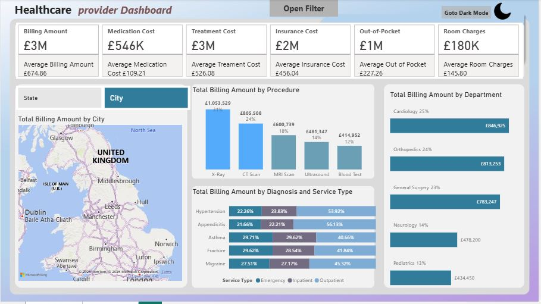
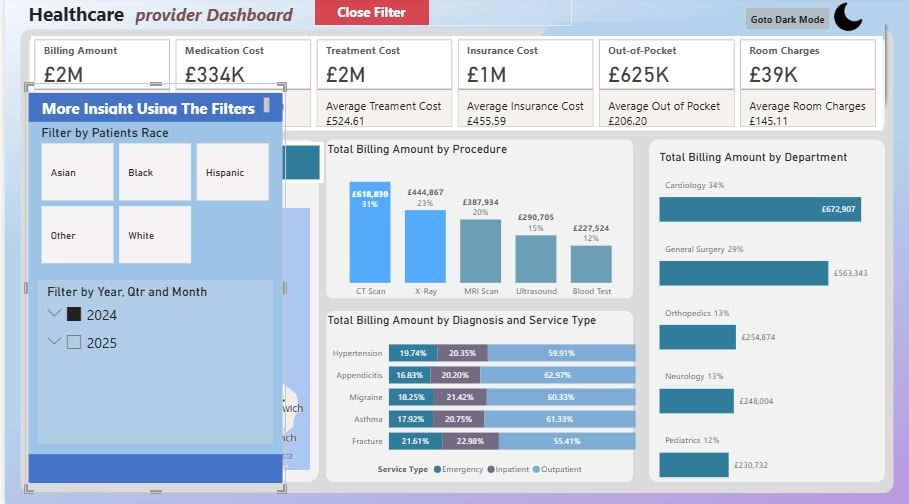

## Bernard Joseph Oyakhilome

# Healthcare Provider Dashboard – Power BI Portfolio Project

## Project Overview
This Power BI dashboard was created to analyze healthcare provider performance across billing, treatment cost, insurance, diagnosis, procedure type, and patient demographics. It provides insights to help healthcare administrators, finance teams, and operations departments make informed decisions based on real data from 2024 and 2025.

The dashboard includes filtering capabilities by patient race, year, quarter, and month — enabling granular views across multiple metrics.

---

## Tools & Technologies Used
- **Power BI** – Data Modeling, Power Query, DAX, Visualizations
- **Power Query Editor** – Data Cleaning & Transformation
- **CSV Files** – Original data source
- **DAX** – Custom measures for cost analysis and patient segmentation

---

## 📂 Table of Contents
1. [Project Overview](#-project-overview)  
2. [Dataset Structure](#-dataset-structure)  
3. [Dashboard Preview](#-dashboard-preview)  
4. [Insights & Observations](#-insights--observations)  
5. [Recommendations](#-recommendations)  
6. [Team Goals](#-team-goals)  
7. [Key Visuals](#-key-visuals)

---

## Dataset Structure
The dataset was provided in **CSV format** and loaded into Power BI. It included the following tables:
- Cities
- Departments
- Diognoses
- Insurance
- Patients
- Procedures
- Providers
- Visits

Data was transformed using **Power Query** and modeled into a **star schema** with fact and dimension tables.

---

## 🖼️ Dashboard Preview

> - Multi-year Comparison: 2024 vs 2025  
> - Filter by Patient Race, Time Period  
> - Department & Procedure Breakdown  
> - Diagnosis and Service Type Insights  
> - Geographic Billing by City

---

## 📈 Insights & Observations

- **Billing increased** from **£1M in 2024** to **£3M in 2025**.
- **CT Scans** became the most billed procedure in 2025.
- **Cardiology** emerged as the top-earning department in 2025.
- **Asthma, Hypertension**, and **Fracture** diagnoses dominate billing.
- **Emergency services** accounted for the majority of high-cost cases.
- **Geographic billing** hotspots were observed in **London and Birmingham**.
- **Billing disparities** noted across racial demographics.

---

## 💡 Recommendations

- Increase **resource allocation** to Cardiology and Orthopedics.
- Address **rising CT Scan costs** with contract renegotiation.
- Develop **chronic disease management programs** for Asthma & Hypertension.
- Reassess **insurance policy impacts** on patient out-of-pocket costs.
- Expand services in **high-billing cities** to improve access and reduce strain.

---

## 👥 Team Goals

| Team            | Objective                                                                 |
|-----------------|---------------------------------------------------------------------------|
| **Admin Team**  | Improve service quality by understanding trends across departments, cities, and race. |
| **Finance Team**| Pinpoint high-revenue procedures & departments, track cost anomalies.     |
| **Operations**  | Allocate staff/resources based on department demand and diagnosis types.  |

---

# 🧩 Key Visuals

### 🔗 Power Query View
> *(Add image here once available)*

### 🔗 Data Model View
> *(Add image here once available)*

### 🔗 Dashboard Visual

---

## 📁 Project Files

| File                        | Description                     |
|-----------------------------|----------------------------------|
| `Dataset`                  | [Download CSV](#)                |
| `Power BI File (.pbix)`    | [Download PBIX](#)               |
| `Full Portfolio Report`    | [Download PDF](#) *(coming soon)*|

---

## 📣 Author

**Bernard Joseph**  
Business Intelligence Analyst  
[LinkedIn](#) • [GitHub](#) • [Portfolio](#)

---
